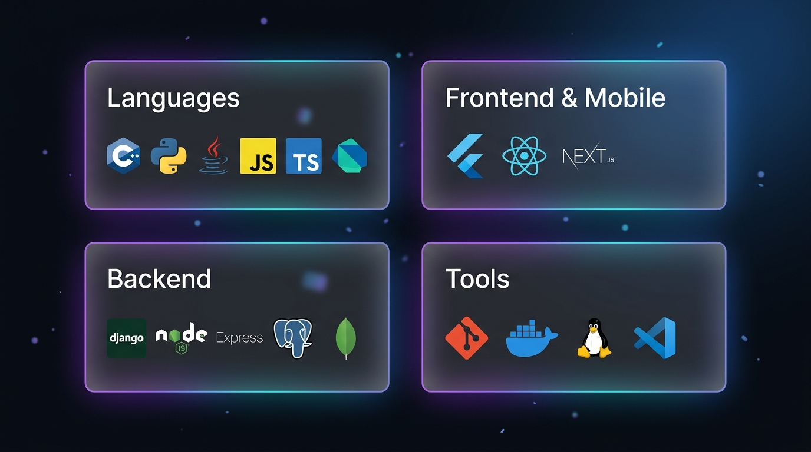

<!-- ═══════════════════════════════════════════════════════════════════ -->
<!--              JUBAYER AHMED SOJIB — GitHub Profile README         -->
<!-- ═══════════════════════════════════════════════════════════════════ -->

<div align="center">

<!-- ─────────── GLASSMORPHISM HEADER ─────────── -->


<br/><br/>

[](https://github.com/clear20-22)

<br/>

<!-- ─────────── QUICK LINKS ─────────── -->

<a href="https://portfolio-theta-weld-61.vercel.app/">

</a>
&nbsp;
<a href="https://linkedin.com/in/jubayer-ahmed-sojib-462938331">

</a>
&nbsp;
<a href="mailto:jubayerahmedsojib@gmail.com">

</a>
&nbsp;


</div>

<br/>

<!-- ═══════════════════════════════════════════════════════════════════ -->
<!--                         ABOUT SECTION                            -->
<!-- ═══════════════════════════════════════════════════════════════════ -->

<div align="center">

</div>

<br/>

<!-- ═══════════════════════════════════════════════════════════════════ -->
<!--                       TECH STACK SECTION                         -->
<!-- ═══════════════════════════════════════════════════════════════════ -->

<div align="center">



<br/><br/>

<!-- Live interactive skill icons row for accessibility -->

<a href="https://skillicons.dev">

</a>

<br/>

<a href="https://skillicons.dev">

</a>

<br/>

<a href="https://skillicons.dev">

</a>

</div>

<br/>

<!-- ═══════════════════════════════════════════════════════════════════ -->
<!--                  COMPETITIVE PROGRAMMING SECTION                 -->
<!-- ═══════════════════════════════════════════════════════════════════ -->

<div align="center">


<br/><br/>

<a href="https://codeforces.com/profile/_c-p_">

</a>
&nbsp;
<a href="https://leetcode.com/u/_Sojib_/">

</a>
&nbsp;
<a href="https://www.codechef.com/users/clear23">

</a>
&nbsp;
<a href="https://auth.geeksforgeeks.org/user/sojib14s976">

</a>

<br/><br/>

<!-- LeetCode Dynamic Stats Card -->
<a href="https://leetcode.com/u/_Sojib_/">

</a>

</div>

<br/>

<!-- ═══════════════════════════════════════════════════════════════════ -->
<!--                    GITHUB STATS SECTION                          -->
<!-- ═══════════════════════════════════════════════════════════════════ -->

<div align="center">


<br/><br/>

<!-- GitHub Streak — using demolab (the official primary host) -->


<br/><br/>

<!-- Snake Contribution Graph (auto-generated via GitHub Action) -->
<picture>
  <source media="(prefers-color-scheme: dark)" srcset="https://raw.githubusercontent.com/clear20-22/clear20-22/output/github-snake-dark.svg" />
  <source media="(prefers-color-scheme: light)" srcset="https://raw.githubusercontent.com/clear20-22/clear20-22/output/github-snake.svg" />
  
</picture>

<br/>

<sub>🐍 The snake above eats my contribution graph daily — powered by <a href="https://github.com/Platane/snk">Platane/snk</a> GitHub Action</sub>

</div>

<br/>

<!-- ═══════════════════════════════════════════════════════════════════ -->
<!--                          FOOTER                                  -->
<!-- ═══════════════════════════════════════════════════════════════════ -->

<div align="center">

```
 ╔═══════════════════════════════════════════════════════════╗
 ║                                                           ║
 ║   "First, solve the problem. Then, write the code."       ║
 ║                                     — John Johnson        ║
 ║                                                           ║
 ╚═══════════════════════════════════════════════════════════╝
```

<br/>


&nbsp;


<br/><br/>

<sub>⭐ Star my repos if you find them useful!</sub>

</div>
