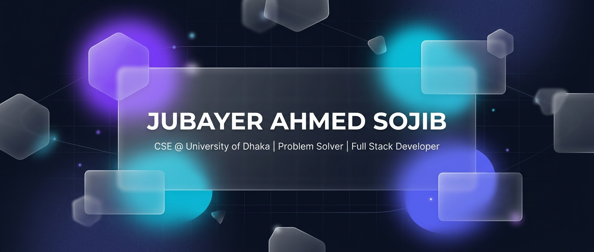
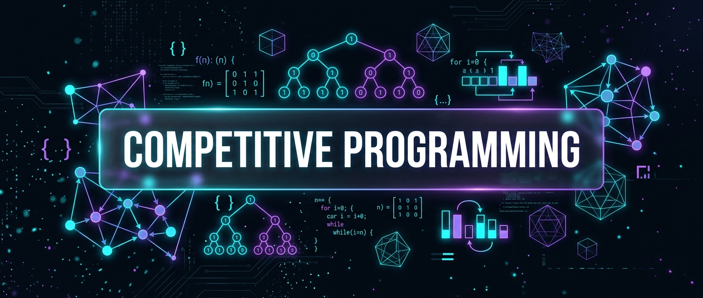

<!-- ═══════════════════════════════════════════════════════════════════ -->
<!--              JUBAYER AHMED SOJIB — GitHub Profile README         -->
<!-- ═══════════════════════════════════════════════════════════════════ -->

<div align="center">

<!-- ─────────── GLASSMORPHISM HEADER BANNER ─────────── -->



<br/><br/>

<!-- ─────────── ANIMATED TYPING ─────────── -->

[](https://github.com/clear20-22)

<!-- ─────────── QUICK LINKS ─────────── -->

<a href="https://portfolio-theta-weld-61.vercel.app/"></a>
<a href="https://linkedin.com/in/jubayer-ahmed-sojib-462938331"></a>
<a href="https://codeforces.com/profile/_c-p_"></a>
<a href="https://leetcode.com/u/_Sojib_/"></a>
<a href="mailto:jubayerahmedsojib@gmail.com"></a>
<br/>


</div>

<br/>

<!-- ═══════════════════════════════════════════════════════════════════ -->
<!--                         ABOUT SECTION                            -->
<!-- ═══════════════════════════════════════════════════════════════════ -->

<div align="center">

## `> whoami`

</div>

<table>
<tr>
<td width="55%" valign="top">

### 🧠 Who I Am

I'm a **Computer Science** undergraduate at the **University of Dhaka** — obsessed with algorithmic problem solving and building real-world software.

- 🏛️ Studying **CSE** at **University of Dhaka**
- ⚡ Active competitive programmer on **Codeforces**, **LeetCode**, **CodeChef**
- 📱 Cross-platform apps with **Flutter** & **React Native**
- 🌐 Full-stack with **Next.js**, **Django**, **Node.js**
- 🔬 Deep into **System Design** & **Distributed Systems**
- 🧩 Lover of **Graph Theory**, **DP**, and **Segment Trees**

</td>
<td width="45%" valign="top">

### 🎯 Current Goals — 2026

- [ ] 🔥 Reach **Expert** on Codeforces
- [ ] 📦 Ship 3 open source production projects
- [ ] 🏆 Solve 500+ problems on LeetCode
- [ ] 🧠 Master advanced CP techniques (FFT, HLD, Centroid Decomposition)
- [ ] 🚀 Land a high-impact engineering internship
- [ ] 📱 Launch a Flutter app on Play Store

</td>
</tr>
</table>

<br/>

<!-- ═══════════════════════════════════════════════════════════════════ -->
<!--                       TECH STACK SECTION                         -->
<!-- ═══════════════════════════════════════════════════════════════════ -->

<div align="center">

## `> cat tech_stack.yml`

<br/>

<table>
<tr>
<td align="center" width="25%">

**`💻 Languages`**
<br/><br/>
<a href="https://skillicons.dev"></a>
<br/>
<a href="https://skillicons.dev"></a>

</td>
<td align="center" width="25%">

**`📱 Frontend & Mobile`**
<br/><br/>
<a href="https://skillicons.dev"></a>
<br/>
<a href="https://skillicons.dev"></a>

</td>
<td align="center" width="25%">

**`⚙️ Backend & Data`**
<br/><br/>
<a href="https://skillicons.dev"></a>
<br/>
<a href="https://skillicons.dev"></a>

</td>
<td align="center" width="25%">

**`🧰 DevOps & Tools`**
<br/><br/>
<a href="https://skillicons.dev"></a>
<br/>
<a href="https://skillicons.dev"></a>

</td>
</tr>
</table>

</div>

<br/>

<!-- ═══════════════════════════════════════════════════════════════════ -->
<!--                  COMPETITIVE PROGRAMMING SECTION                 -->
<!-- ═══════════════════════════════════════════════════════════════════ -->

<div align="center">

## `> ./competitive_programming --stats`



<br/><br/>

<a href="https://codeforces.com/profile/_c-p_"></a>
&nbsp;
<a href="https://leetcode.com/u/_Sojib_/"></a>
&nbsp;
<a href="https://www.codechef.com/users/clear23"></a>
&nbsp;
<a href="https://auth.geeksforgeeks.org/user/sojib14s976"></a>

<br/><br/>

<!-- LeetCode Dynamic Stats Card with Heatmap -->
<a href="https://leetcode.com/u/_Sojib_/">

</a>

</div>

<br/>

<!-- ═══════════════════════════════════════════════════════════════════ -->
<!--                    GITHUB ANALYTICS SECTION                      -->
<!-- ═══════════════════════════════════════════════════════════════════ -->

<div align="center">

## `> git stats --all`

<br/>

<!-- ─── Row 1: GitHub Stats + Top Languages ─── -->


<br/><br/>

<!-- ─── Row 2: GitHub Streak ─── -->


<br/><br/>

<!-- ─── Row 3: Profile Summary Cards (5 cards) ─── -->


<br/>


<br/>


<br/><br/>

<!-- ─── Row 4: Contribution Snake ─── -->

<picture>
  <source media="(prefers-color-scheme: dark)" srcset="https://raw.githubusercontent.com/clear20-22/clear20-22/output/github-snake-dark.svg" />
  <source media="(prefers-color-scheme: light)" srcset="https://raw.githubusercontent.com/clear20-22/clear20-22/output/github-snake.svg" />
  
</picture>

<sub>🐍 Snake eats my contribution graph daily via <a href="https://github.com/Platane/snk">GitHub Action</a></sub>

</div>

<br/>

<!-- ═══════════════════════════════════════════════════════════════════ -->
<!--                       FEATURED PROJECTS                          -->
<!-- ═══════════════════════════════════════════════════════════════════ -->

<div align="center">

## `> ls ~/projects --featured`

</div>

<br/>

<table>
<tr>
<td width="50%" valign="top">

<h3 align="center">🌐 Personal Portfolio</h3>
<p align="center">
<a href="https://portfolio-theta-weld-61.vercel.app/">

</a>
</p>
<p align="center">Modern responsive portfolio with smooth animations, project showcases, and contact integration.</p>
<p align="center">


</p>

</td>
<td width="50%" valign="top">

<h3 align="center">💻 CP Algorithm Templates</h3>
<p align="center">
<a href="https://github.com/clear20-22">

</a>
</p>
<p align="center">Battle-tested competitive programming templates — segment trees, graph algos, FFT, and more.</p>
<p align="center">


</p>

</td>
</tr>
</table>

<br/>

<!-- ═══════════════════════════════════════════════════════════════════ -->
<!--                          FOOTER                                  -->
<!-- ═══════════════════════════════════════════════════════════════════ -->

<div align="center">


```
 ╔═══════════════════════════════════════════════════════════╗
 ║                                                           ║
 ║   "First, solve the problem. Then, write the code."       ║
 ║                                       — John Johnson      ║
 ║                                                           ║
 ╚═══════════════════════════════════════════════════════════╝
```


&nbsp;


<br/><br/>

<sub>⭐ If you find my repos useful, drop a star — it means the world!</sub>

</div>
